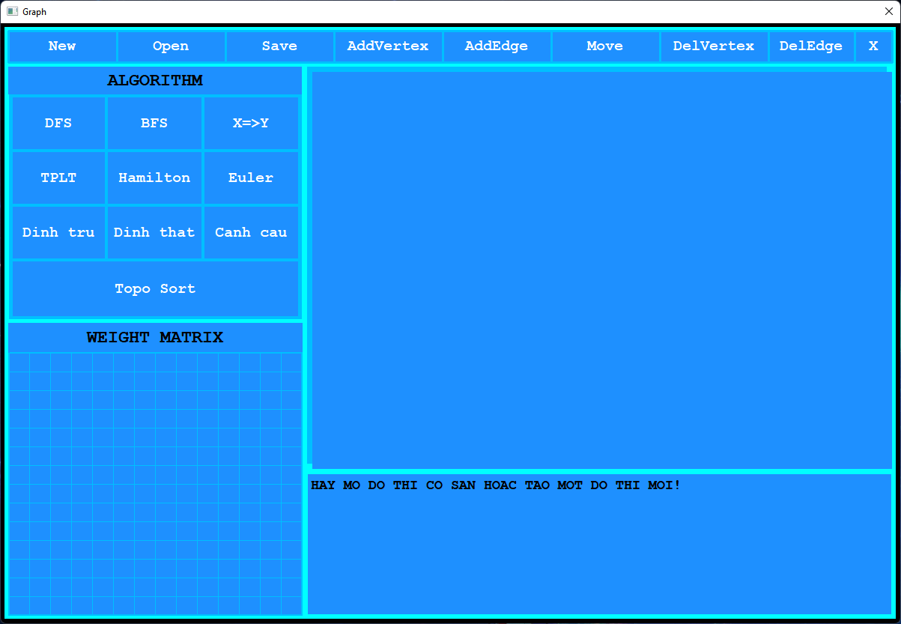
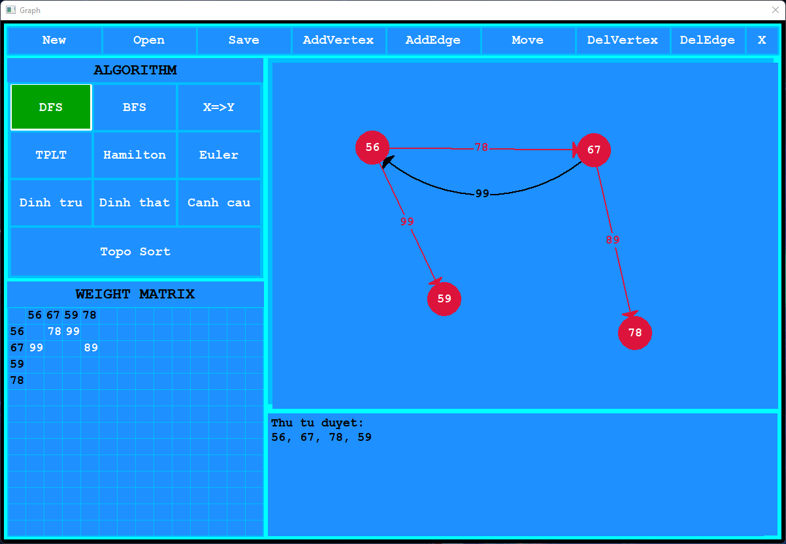
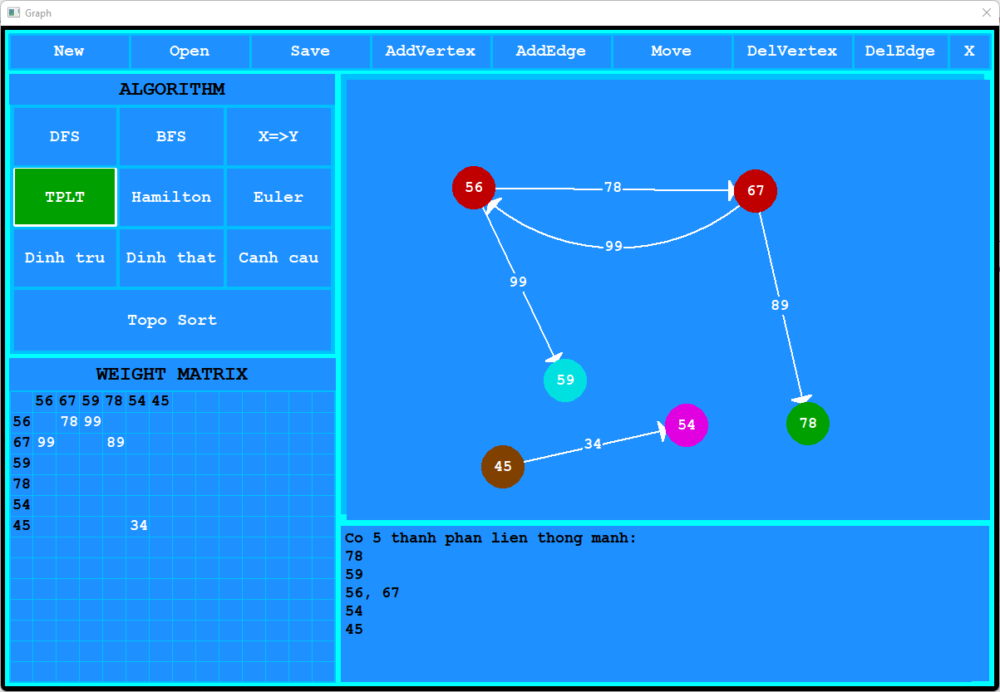

# Graph algorithm visualization
## Yêu cầu
- Nhập đồ thị có hướng có trọng số qua giao diện, có thể thêm, xóa sửa lại đỉnh, cung, trọng số ( trên màn hình hiện thị ma trận kế tương ứng). 
- Lưu đồ thị vào file sao cho ta có thể vẽ lại đồ thị về sau này. 
- Demo giải thuật DFS, BFS 
- Tính số thành phần liên thông của đồ thị? Và liệt kê các đỉnh trong từng thành phần liên thông 
- Tìm đường đi ngắn nhất từ đỉnh X đến đỉnh Y, có demo trên hình và in ra đường đi cụ thể. 
- Tìm tất cả đỉnh trụ , đinh thắt và cạnh cầu của đồ thị. 
- Tìm các chu trình Hamilton, và chu trình Euler của đồ thị (nếu có) 
- Demo thuật toán Topo Sort
## Một số hạn chế của đồ án
- Lúc nhập tên đỉnh hoặc nhập trọng số của cung thì không nên bắt buộc người dùng nhập đúng 2 số. Ví dụ: khi nhập "1" rồi ấn enter thì nên nhận luôn giá trị đó.
- Khi nhập tên "00" thì nên báo cho người dùng biết rằng đã nhập sai, yêu cầu người dùng nhập lại.
- Lúc save và nhập tên file nên đưa ra cảnh báo người dùng hỏi người dùng có ghi đè trong trường hợp nhập trùng tên file đã có trong thư mục saves không.
- Các thuật toán nên được cải thiện với các số liệu lớn hơn.
- Giao diện save nên tích hợp chung với open.
- Khi ấn open, và chọn 1 file bất kì, nên tích hợp thêm chức năng click đúp chuột để mở file.
## Một số hình ảnh của đồ án

